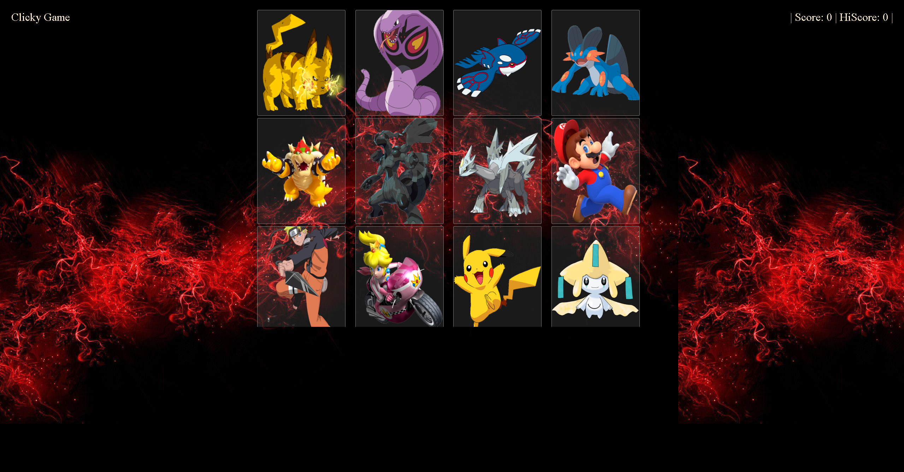

# Pokemon Memory Game
> Pokemon Themed Game to test your memory!  Click each image once to win!

[![NPM Version][npm-image]][npm-url]
[![Build Status][travis-image]][travis-url]
[![Downloads Stats][npm-downloads]][npm-url]

Pokemon Memory Game is a Heroku hosted memory game.  It utilizes React.js to render the page.  Once the virtual DOM is rendered it includes 12 images that are randomized each time a card is clicked.  To begin the game simply click on any image.  Be careful to remember what you clicked!  Clicking an image twice will reset the game!  Have fun!

<!-- Markdown link & img dfn's -->
[npm-image]: https://img.shields.io/npm/v/datadog-metrics.svg?style=flat-square
[npm-url]: https://npmjs.org/package/datadog-metrics
[npm-downloads]: https://img.shields.io/npm/dm/datadog-metrics.svg?style=flat-square
[travis-image]: https://img.shields.io/travis/dbader/node-datadog-metrics/master.svg?style=flat-square
[travis-url]: https://travis-ci.org/dbader/node-datadog-metrics
[wiki]: https://github.com/yourname/yourproject/wiki
